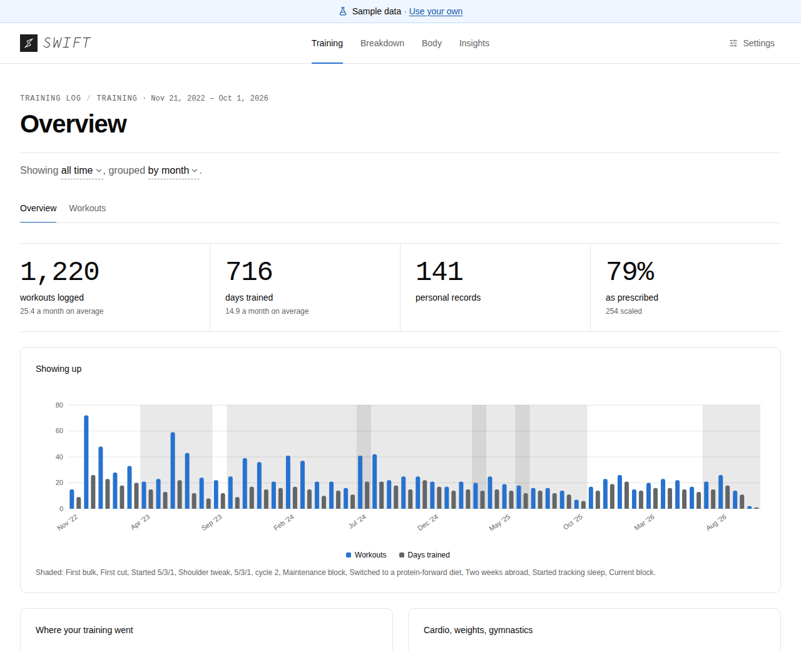
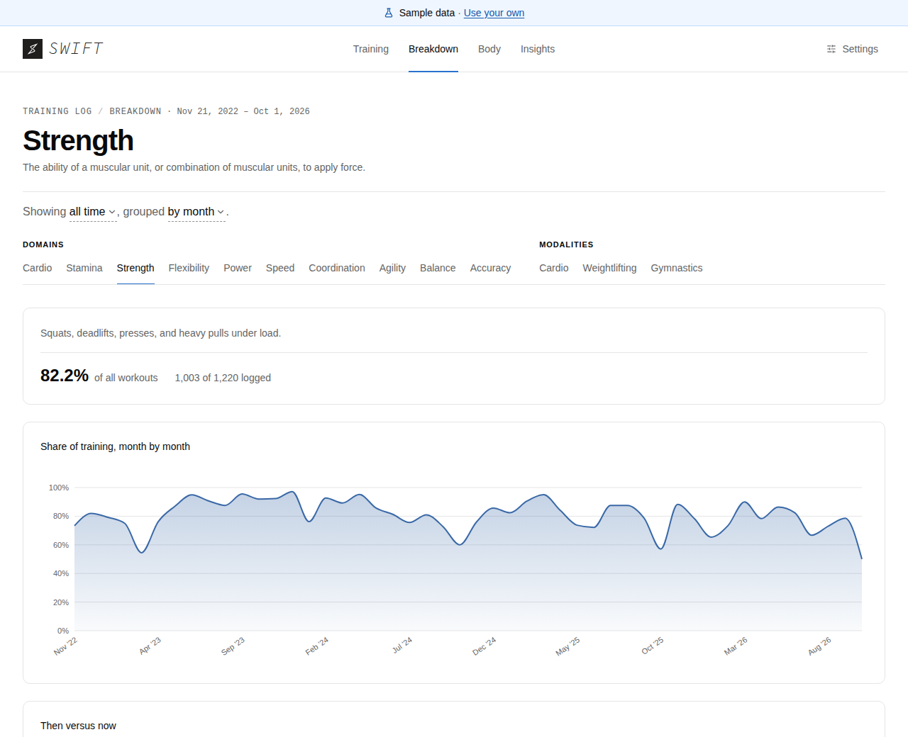
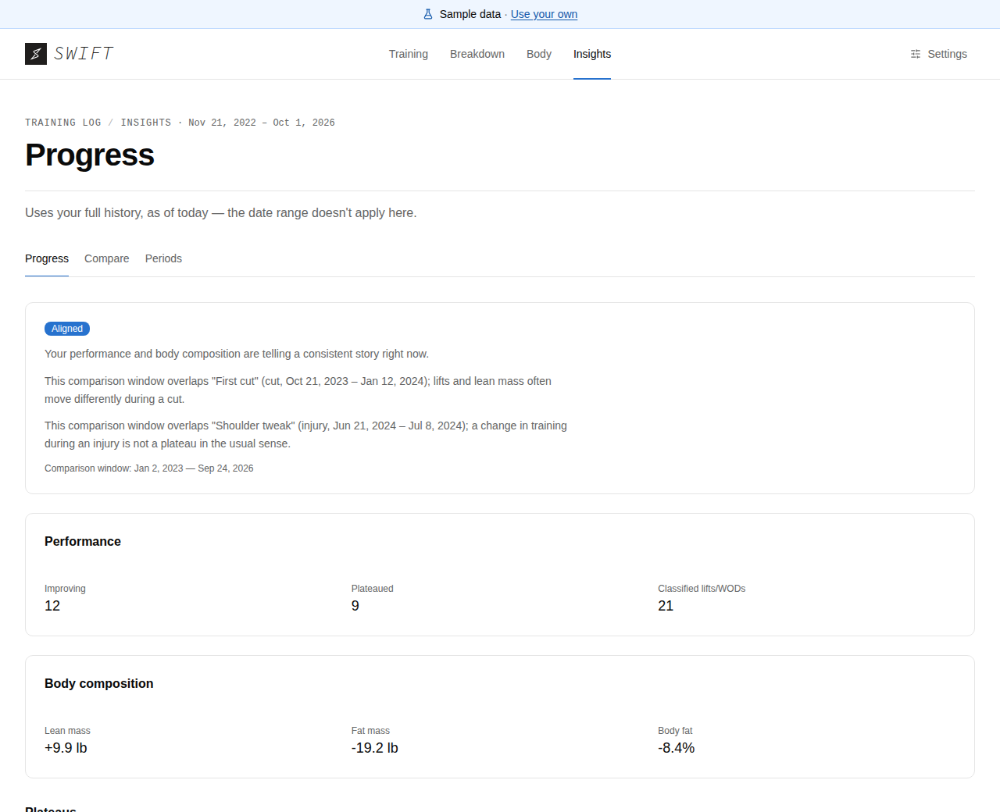

# Swift

*The workout ends. The work doesn't.*

[](https://github.com/ayovev/swift/actions/workflows/ci.yml)
[](LICENSE)


Swift turns a SugarWOD training-history CSV into a dashboard you can read in
a minute. It runs entirely in your browser: **[tryswift.io](https://tryswift.io)**.
There is no account to make and no server to send your file to.

<picture>
  <source media="(prefers-color-scheme: dark)" srcset="docs/images/overview-dark.png">
  
</picture>


## What it shows

- **Consistency and progress.** Workouts over time, lift and benchmark history,
  and a timeline of PRs.
- **What your training is made of.** A breakdown across the ten CrossFit
  general physical skills (the GPP domains), and the proportional mix of
  metabolic conditioning, weightlifting and gymnastics (M/W/G) in your log.
- **Body composition, if you add it.** Upload an InBody export and Swift flags
  which lifts have plateaued and whether body composition is moving alongside
  them. It only counts a change that is bigger than normal scan-to-scan
  variation, estimated from your own scans.
- **Before and after.** Select a range, or mark a stretch like a cut or a new
  program, and compare lifts, benchmarks and body composition against what came
  before.

It is for one athlete looking at their own training. There are no coach views
and no multi-athlete comparisons. Try it without a file using the sample data
on the landing page.

<table>
  <tr>
    <td width="50%">

<picture>
  <source media="(prefers-color-scheme: dark)" srcset="docs/images/breakdown-dark.png">
  
</picture>

</td>
    <td width="50%">

<picture>
  <source media="(prefers-color-scheme: dark)" srcset="docs/images/progress-dark.png">
  
</picture>

</td>
  </tr>
  <tr>
    <td align="center"><sub>Breakdown: one of ten GPP domains</sub></td>
    <td align="center"><sub>Progress: performance against body composition</sub></td>
  </tr>
</table>

*Screenshots use the bundled sample data.*

## Privacy

Your file never leaves your browser. There is no account and no server.

| | |
| --- | --- |
| **Stays in your browser** | Your workout log, InBody history, periods, and your view settings, cached in the browser's own IndexedDB so a reload doesn't need a re-upload. **Start over** in Settings deletes all of it. |
| **Can leave your browser** | Anonymous usage events (page opened, upload succeeded, tab viewed) with fixed names and coarse buckets, and only when an analytics key is configured. Connection setup for device sync touches a public STUN server. |
| **Never leaves your browser** | Workout text, movement names, notes, filenames, exact row counts, body-composition values, or any identifier for you. |

The full account, including how device sync works without a server, is in
[docs/privacy.md](docs/privacy.md).

### Check it yourself

You don't have to take that on trust. Swift is open source and the claim is
small enough to verify.

- **In your browser.** Open DevTools, go to the Network tab, and upload a file.
  The only requests are the app's own files and, if analytics is on, small usage
  events. None of them contain your data.
- **In the code.** There is no backend directory and no API layer. The three
  things that touch the network are the sample-file download in `src/App.tsx`
  (from our own origin), the analytics client in `src/lib/posthog.ts`, and the
  STUN lookup in `src/lib/sync/webrtcTransport.ts`.
- **In the types.** `SwiftEvent` in `src/lib/posthog.ts` is the entire analytics
  surface, written as a narrow union rather than a free-form object, so adding
  free-form content to an event is a type error.
- **In the tests.** `tests/analytics.test.ts` rebuilds real workout titles from
  the sample export and fails if any of them shows up in an event payload.
  `tests/syncAnalytics.test.ts` does the same for sync.
- **On your own copy.** Fork it, leave `VITE_PUBLIC_POSTHOG_KEY` empty, and
  Swift sends no analytics at all. It builds to static files you can host
  anywhere.

## Quick start

Requires Node and npm. Use npm, not yarn or pnpm.

```sh
npm install
cp .env.example .env
npm run dev
```

Other scripts:

```sh
npm run build      # tsc -b && vite build, output in dist/
npm run preview    # serve the production build locally
npm test           # vitest run
npm run test:watch # vitest in watch mode
npm run typecheck  # tsc -b --noEmit
```

`.env.example` has an empty `VITE_PUBLIC_POSTHOG_KEY`. Leave it empty: analytics is optional and no-ops cleanly without a key, so the app runs normally. `.env` is gitignored; `.env.example` is committed with no real value in it.


## Getting your data in

In SugarWOD, open your training log and choose **Export Workouts**, then drop
the CSV on Swift's upload area. Swift expects SugarWOD's own export columns
(`date`, `title`, `description`, `best_result_raw`, `best_result_display`,
`score_type`, `barbell_lift`, `rx_or_scaled`, `pr`) and says in plain language
which one is missing if a file doesn't fit.

An InBody scan-history export is a separate, optional upload. It unlocks the
body-composition view and the Insights views that compare it with your lifts.

[docs/guide.md](docs/guide.md) covers the rest: replacing a file, backing up and
restoring (with optional passphrase encryption), syncing to a second device, and
how Periods work.

## Documentation

- [Using Swift](docs/guide.md): data in, backups, sync, periods
- [Privacy: the details](docs/privacy.md)
- [Architecture](docs/architecture.md): how the code is organised
- [How classification works](docs/classification.md): the GPP and M/W/G logic
- [Testing](docs/testing.md)
- [Contributing](CONTRIBUTING.md) and [Security](SECURITY.md)

Stack: Vite, React, TypeScript, Tailwind CSS, shadcn/ui, Recharts, PapaParse,
dayjs, and the browser's native WebRTC and Web Crypto.

## Known limitations

The body-composition insights (noise band, **Strength**, **Compare**, **Cycles**) are tuned on the
bundled sample and synthetic scans, not on real InBody histories, so their thresholds are starting
points. They are all in `src/lib/analytics/insightConfig.ts`, each with a note on how it was
chosen. Check them against your own history before trusting a number.

Other things to know: training blocks for **Compare** come from periods or typed dates, not automatic
detection; and dragging on a chart is mouse-only, with date inputs as the alternative.

## Deployment

Static SPA on Vercel. `vercel.json` is already configured — `npm run build`, output in `dist`, with a catch-all rewrite to `index.html`. There is no backend to deploy or operate. If PostHog is wanted in production, set `VITE_PUBLIC_POSTHOG_KEY` as a build-time environment variable; without them the deployed app simply runs without analytics.

## License

[MIT](LICENSE). Fork it, read it, run your own copy.

Swift is an independent project and is not affiliated with or endorsed by
SugarWOD, InBody or CrossFit.
